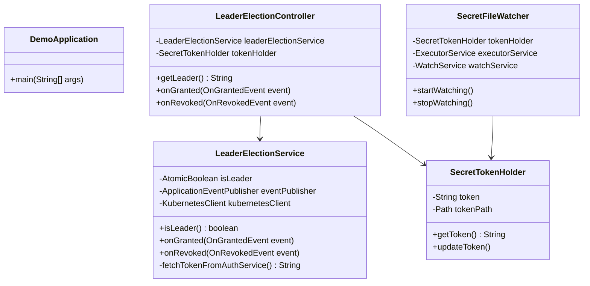

# Spring Boot Leader Election Demo

This project demonstrates how to use Spring Cloud Kubernetes for leader election.

## Prerequisites

*   Java 17
*   Maven
*   Docker
*   Kubernetes cluster (e.g., Minikube, Docker Desktop)

## Building the project

To build the project, run the following command:

```bash
./mvnw clean install
```

## Bumping the version

To bump the version of the application, run the following command:

```bash
./bump-version.sh <new-version>
```

This will:

*   Update the version in `pom.xml`.
*   Update the image version in `kubernetes/deployment.yaml`.
*   Update the image version in `src/test/resources/deployment.yaml`.

## Building the container image

The container image is built using the `docker-maven-plugin`. Running the `install` command will build the image.

The image name is `nontster/spring-leader:<version>`.

## Deploying to Kubernetes

To deploy the application to Kubernetes, run the following commands:

```bash
kubectl apply -f kubernetes/rbac.yaml
kubectl apply -f kubernetes/secret.yaml
kubectl apply -f kubernetes/configmap.yaml
kubectl apply -f kubernetes/deployment.yaml
kubectl apply -f kubernetes/service.yaml
```

## Application Logic

This application demonstrates leader election using `spring-cloud-kubernetes-fabric8-leader`. Spring Cloud Kubernetes provides leader election capabilities by creating a `ConfigMap` in the Kubernetes cluster. Different instances of the application will try to acquire a lock on this `ConfigMap`. The instance that successfully acquires the lock becomes the leader.

When an instance is elected as the leader, it receives an `OnGrantedEvent`. The `LeaderElectionService` listens for this event and triggers the logic to fetch a new access token. In this demo, the token is fetched from a simulated authentication service.

Once the new token is fetched, the leader instance then creates or updates a Kubernetes `Secret` named `shared-access-token`. The new token is stored in this secret. All instances of the application, including the leader and non-leader instances, can then read the token from this secret.

When the leader instance is terminated or is no longer the leader, it receives an `OnRevokedEvent`. The `LeaderElectionService` listens for this event and logs that it is no longer the leader. A new leader will then be elected from the remaining instances.

The `LeaderElectionController` exposes a `/leader` endpoint that indicates whether the current instance is the leader.

## Detecting Secret Updates

To detect secret updates, the application uses a file watcher. The `shared-access-token` secret is mounted as a volume at `/etc/token`. The `SecretFileWatcher` class watches for file system events in this directory. When an event is detected (i.e., when the secret is updated), the `SecretTokenHolder` reloads the token from the mounted file.

This allows the application to get the updated secret without requiring a restart.

## Verifying leader election

To verify leader election, you can check the logs of the pods. Only one pod should be the leader at any given time.

```bash
kubectl logs -l app=leader-election-demo
```

You can also access the `/leader` endpoint to see which pod is the leader.

```bash
kubectl port-forward svc/leader-election-demo 8080:8080
```

Then, in a separate terminal, run:

```bash
curl http://localhost:8080/leader
```

## Class Diagram


