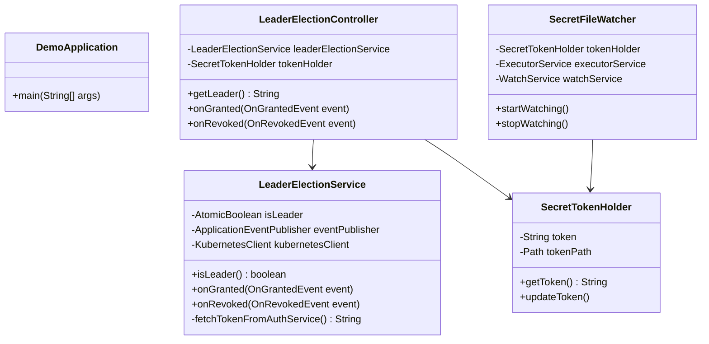

# Spring Boot Leader Election Demo

This project demonstrates a robust leader election mechanism in a distributed system using Spring Cloud Kubernetes. The application is designed to run in a Kubernetes environment where multiple instances (pods) are running, but only one instance, the "leader," is responsible for performing a specific task. In this case, the leader's responsibility is to fetch a new access token and share it with the other instances via a Kubernetes Secret.

## 🚀 Prerequisites
Before you begin, ensure you have the following tools installed:

* Java 17: The project is built using Java 17.
* Maven: Used for building the project and managing dependencies.
* Docker: Required for building and running the container image.
* Kubernetes Cluster: A running Kubernetes cluster is needed for deployment. You can use tools like Minikube, Docker Desktop, or any cloud-based Kubernetes service.
* kubectl: The Kubernetes command-line tool, used for interacting with your cluster.

## 🛠️ Building the project

To build the project, run the following command:

```bash
./mvnw clean install
```
This command will compile the source code, run tests, and package the application into a JAR file in the target/ directory.

## 🏗️ Building the Container Image
The project uses the `docker-maven-plugin` to build a container image. The image is built automatically when you run the install command.

The image will be named `nontster/spring-leader:<version>`, where `<version>` is the version specified in the `pom.xml` file.

## ⬆️ Bumping the version

A helper script is provided to simplify the process of updating the application version. To bump the version, use the `bump-version.sh` script:

```bash
./bump-version.sh <new-version>
```

Replace `<new-version>` with the desired version number (e.g., `1.1.0`). This script will:

* Update the version in the `pom.xml` file.
* Update the image version in `kubernetes/deployment.yaml`.
* Update the image version in `src/test/resources/deployment.yaml`.

## 🎨 Design and Implementation
This application showcases a sophisticated design for leader election and secret management in a distributed environment.

### Leader Election Mechanism

The core of the leader election logic is provided by the `spring-cloud-kubernetes-fabric8-leader` library. This library leverages Kubernetes resources to implement a distributed locking mechanism.

Here's how it works:

1. **ConfigMap Lock**: The application instances compete to acquire a lock on a shared `ConfigMap` in the Kubernetes cluster (named `leader` in this project).

2. **Leader Election**: The instance that successfully acquires the lock becomes the leader. The other instances will continue to attempt to acquire the lock until the current leader is terminated or relinquishes the lock.

3. **Event-Driven Logic**: The application uses an event-driven model to react to leader election events:

   * `OnGrantedEvent`: When an instance becomes the leader, it receives an `OnGrantedEvent`. The `LeaderElectionService` listens for this event and triggers the logic to fetch a new access token.

   * `OnRevokedEvent`: When the leader instance is no longer the leader, it receives an `OnRevokedEvent`. The `LeaderElectionService` listens for this event and logs that it is no longer the leader.

### 🔑 Secret Management and Token Refresh

Once an instance is elected as the leader, its primary responsibility is to refresh and distribute a shared access token.

1. **Token Fetching**: The leader instance simulates fetching a new access token from an authentication service.

2. **Secret Creation/Update**: The leader then creates or updates a Kubernetes `Secret` named `shared-access-token` with the new token. The token is Base64 encoded before being stored in the secret.

3. **Secret Propagation**: The `shared-access-token` secret is mounted as a volume at `/etc/token` in all application pods.

4. **Real-time Secret Updates**: To ensure that all instances have the latest token without requiring a restart, the application uses a file watcher. The `SecretFileWatcher` class monitors the mounted secret directory for changes. When the secret is updated by the leader, the file watcher detects the change and triggers the `SecretTokenHolder` to reload the token from the file.

### Health Probes

The application includes readiness and liveness probes to ensure its health and reliability in the Kubernetes environment.

* 🟢 Readiness Probe: The readiness probe checks the `/actuator/health/readiness` endpoint. It includes a custom `TokenReadinessProbe` that checks if the access token is available in the `SecretTokenHolder`. A pod will only be marked as "Ready" and receive traffic if the token is present.

* 🟢 Liveness Probe: The liveness probe checks the `/actuator/health/liveness` endpoint. If this probe fails, Kubernetes will restart the container.##

## 🚢 Deploying to Kubernetes

To deploy the application to your Kubernetes cluster, follow these steps:

1. **Apply RBAC Configuration**: This creates the necessary `ServiceAccount`, `Role`, and `RoleBinding` to allow the application to interact with the Kubernetes API.

    ```bash
    kubectl apply -f kubernetes/rbac.yaml
    ```

2. **Create the Secret**: This creates an empty Secret that will be populated by the leader pod.

    ```bash
    kubectl apply -f kubernetes/secret.yaml
    ```

3. **Create the ConfigMap**: This creates the ConfigMap used for the leader election lock.

    ```bash
    kubectl apply -f kubernetes/configmap.yaml
    ```

4. Deploy the Application: This deploys the application with three replicas.

    ```bash
    kubectl apply -f kubernetes/deployment.yaml
    ```

5. Expose the Application: This creates a Service to expose the application to the network.

    ```bash
    kubectl apply -f kubernetes/service.yaml
    ```

## ✅ Verifying Leader Election

You can verify that the leader election is working correctly by following these steps:

1. **Check Pod Logs**: View the logs of all the pods. Only one pod should log the message "👑 I am the leader! Fetching and sharing the token."

    ```bash
    kubectl logs -l app=leader-election-demo
    ```

2. Access the `/leader` Endpoint: The `/leader` endpoint will tell you if the instance you are accessing is the leader.

   * First, find Load balancer IP address (when using Loadbalancer) or Node IP address (when using NodePort):

   * access the endpoint:
    ```bash
    curl http://<IP Address>:8080/leader
    ```

## 📈 Class Diagram


